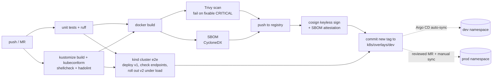

# k8s-gitops-deploy

[](https://github.com/sonubepop/k8s-gitops-deploy/actions/workflows/ci.yml)

A complete, working delivery pipeline for a containerised Python service on Kubernetes:
**test → validate manifests → build → vulnerability scan → SBOM → keyless image signing → end-to-end test on a
real kind cluster (including a zero-downtime rolling update) → GitOps promotion that Argo CD deploys.**

The same pipeline is implemented twice: [GitHub Actions](.github/workflows/ci.yml) (runs on every push here) and
[GitLab CI/CD](.gitlab-ci.yml) (validated against GitLab's CI schema; mirror the repo to GitLab to run it).

## Pipeline



## What's in the repo

| Path | What it is |
|---|---|
| `app/` | Small Flask service (`/`, `/healthz`, `/readyz`, `/metrics`) that reports which version is live - useful to watch a rollout |
| `Dockerfile` | Multi-stage build, non-root user, OCI labels, works with a read-only root filesystem |
| `k8s/base` | Deployment (readiness/liveness probes, resource limits, `preStop` drain, restricted security context), Service, PodDisruptionBudget |
| `k8s/overlays/{dev,prod}` | Kustomize overlays - namespace, replicas, config, image tag; prod adds an HPA and a stricter PDB |
| `k8s/overlays/e2e` | Dev overlay pointed at locally built images, used by the kind test |
| `argocd/` | AppProject + Applications: dev auto-syncs (prune + self-heal), prod syncs manually |
| `monitoring/` | Grafana dashboard (RPS, error ratio, p50/p95/p99 latency, ready pods, running versions) + ServiceMonitor |
| `scripts/e2e-test.sh` | Deploys v1, checks all endpoints from inside the cluster, rolls out v2 while sending traffic, fails if any request is dropped |
| `scripts/local-up.sh` | One command to run kind + Argo CD (+ optional Prometheus/Grafana) on your laptop |

## GitOps flow

1. A merge to `main` builds, scans, signs and pushes `ghcr.io/sonubepop/k8s-gitops-deploy:<sha>`.
2. After the kind e2e test passes, CI commits that tag to `k8s/overlays/dev/kustomization.yaml`.
3. Argo CD notices the commit and syncs the dev namespace. Nothing in CI has cluster credentials.
4. Promoting to prod = a reviewed change of the tag in `k8s/overlays/prod`, then a manual sync.

Rollback is `git revert` of the tag commit.

## Run it locally

```bash
./scripts/local-up.sh               # kind + Argo CD + the dev environment synced from GitHub
./scripts/local-up.sh --monitoring  # also kube-prometheus-stack and the Grafana dashboard
```

Verify a signed image:

```bash
cosign verify ghcr.io/sonubepop/k8s-gitops-deploy:latest \
  --certificate-identity-regexp 'https://github.com/sonubepop/k8s-gitops-deploy/.*' \
  --certificate-oidc-issuer https://token.actions.githubusercontent.com
```

## Design notes

- **No cluster credentials in CI.** CI only writes to git; Argo CD pulls. That's the main security benefit of GitOps.
- **Zero-downtime rollouts** come from `maxUnavailable: 0`, a readiness probe, and a short `preStop` sleep so the
  Service stops routing to a pod before it shuts down. The e2e test proves it on every run.
- **Supply chain:** Trivy blocks fixable critical CVEs, Syft/anchore produces a CycloneDX SBOM, and cosign signs the image
  keyless via the CI provider's OIDC token and attaches the SBOM as an attestation.
- **Secrets:** the app needs none; in a real setup they'd come from Vault via the External Secrets Operator
  rather than living in git or CI variables.

## License

MIT
